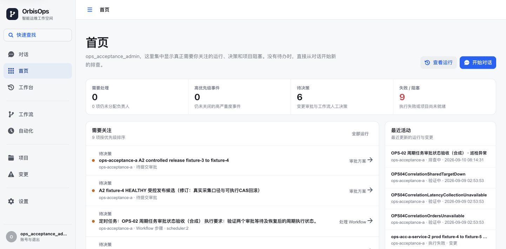
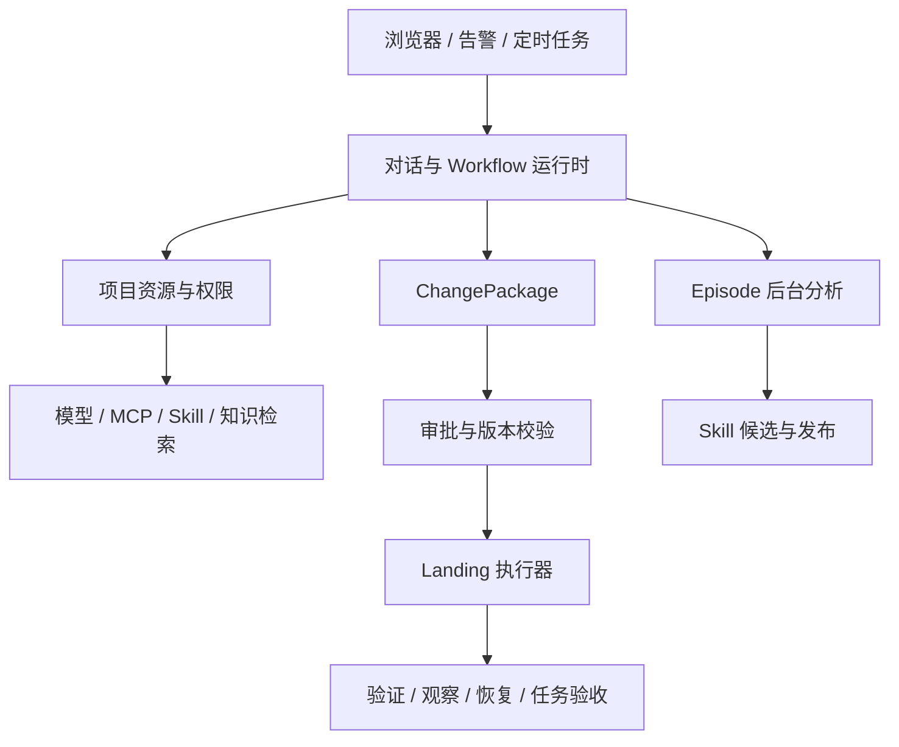

<div align="center">

# OrbisOps

**让运维调查、自动化执行和生产变更进入同一条可审计流程。**

自然语言调查 · 可视化 Workflow · MCP · 三阶段治理 · Skill 演进

[](server/pom.xml)
[](web/package.json)
[](LICENSE)

[快速开始](#快速开始) · [架构](#架构) · [开发与验证](#开发与验证) · [当前状态](#当前状态)

</div>

OrbisOps 是面向运维工作的 Agent 控制台。用户用自然语言说明问题，系统在项目权限范围内调查、调用工具和整理证据；重复流程可以沉淀为 Workflow。生产写入须经过变更包、审批、受控执行和结果验收。

## 使用流程

1. 创建项目，绑定模型、测试与生产 MCP、执行目标和知识资源。
2. 从对话开始调查，或在可视化编辑器创建、校验并发布 Workflow。
3. 在工作台查看步骤、工具调用、任务和证据，补充必要的业务条件。
4. 确认 Prepare 产生的变更包；按规则审批后进入 Landing。
5. 分别记录执行、PostCheck、Observe、Recovery 结果，通过正常任务验收。
6. 后台按 Episode 分析工作，形成可审核的 Skill 创建或修订候选。



## 核心能力

| 领域 | 能力 |
| --- | --- |
| 调查与执行 | ReAct 对话、Workflow、版本发布、运行记录与原始证据 |
| 资源与权限 | 项目隔离；模型、MCP、Skill、知识库与执行目标管理 |
| 变更治理 | Discovery → Prepare → Landing；包版本、审批、执行与验证绑定 |
| 任务与告警 | 定时巡检、归属传递、重复去重与事件关联，保留原始告警 |
| 经验沉淀 | Episode 分段、24 小时暂定结尾、晚到消息重新分析、后台持久重试 |
| 工作台 | 会话、任务、告警、变更、审计和设置，共享布局与导航契约 |

测试与生产环境分别通过 MCP 接入资源。Discovery / Prepare 保持调查权限；生产非只读能力只在满足审批及包版本约束的 Landing 执行范围内开放。模型和页面按钮均不能自行授予生产写权限。

## 架构



Java 多模块区分领域规则、应用服务、基础设施和入口；React 使用统一工作台布局及服务端状态。MySQL 保存业务记录，PostgreSQL / pgvector 保存知识与记忆向量，Redis 承担协调。外部资源通过明确的 MCP 和执行器契约接入。

## 快速开始

需要 Docker Compose v2。源码使用 Java 17+、Node.js 与 npm；完整验收脚本可显式选择本机 JDK 21。

```sh
git clone https://github.com/lgs0809/OrbisOps.git
cd OrbisOps
cp deploy/orbisops.env.example deploy/orbisops.env
# 在本机填写基础设施和认证密钥，替换占位值
make deploy-preflight
make up
```

默认页面为 **[http://127.0.0.1:3002](http://127.0.0.1:3002)**，API 为 **[http://127.0.0.1:8099](http://127.0.0.1:8099)**。首次从页面创建管理员，再创建项目并配置实际模型与 MCP。模型服务不会由仓库自动下载或启动。

当前隔离验收页面为 **[http://127.0.0.1:3302](http://127.0.0.1:3302)**，API 为 **[http://127.0.0.1:18089](http://127.0.0.1:18089)**。关联数据、初始化脚本和检查 SQL 见 [验收目录](deploy/acceptance/) 与 [开发状态](docs/development/OrbisOps-当前开发状态.md)。初始化冲突拒绝覆盖；审批、发布和验收通过正常流程执行。

```sh
# 停止应用，保留持久卷
make down
```

## 开发与验证

```sh
make release-hygiene
cd server && mvn -B test
cd ../web && npm ci && npm run verify
```

完整隔离验收使用 `scripts/run-full-acceptance-tests.py`，受测产物部署使用 `scripts/deploy-tested-acceptance.py`。先阅读参数及 [验收状态](docs/development/OrbisOps-当前开发状态.md)。普通测试、真实组件、模型质量和业务验收分别记录。

```text
server/
  orbisops-domain/          领域模型与规则
  orbisops-application/     应用服务与编排
  orbisops-infrastructure/  存储、模型与外部适配
  orbisops-trigger/         HTTP、任务和运行入口
  orbisops-api/             公开契约
  orbisops-app/             装配、配置与架构检查
web/src/                   页面、共享工作台与资源查询
deploy/acceptance/         隔离部署、种子资料和检查 SQL
scripts/                   验证、部署、初始化及只读核对
docs/                      架构、开发和分批验收记录
```

## 当前状态

已完成本地部署、关联数据、普通回归及 Workflow、审批的真实页面操作，保留运行和资源读回证据。当前前端 278 项单元测试和原有 40 项浏览器测试全部通过，另有部署后的真实导航与证据展示验证，见 [Web 验证记录](docs/acceptance/2026-10-04-Web-CI修复.md)。

仍未完成：完整三阶段 SLO / Recovery / 任务验收闭环，Skill 新候选的完整自动沉淀与复用，万级权限过滤检索的稳定预算，以及剩余正式评测。模型超时和已失败运行均保留；不宣称全部功能完成。详见 [当前状态与恢复入口](docs/development/OrbisOps-当前开发状态.md)。

## License

[Apache License 2.0](LICENSE)。
