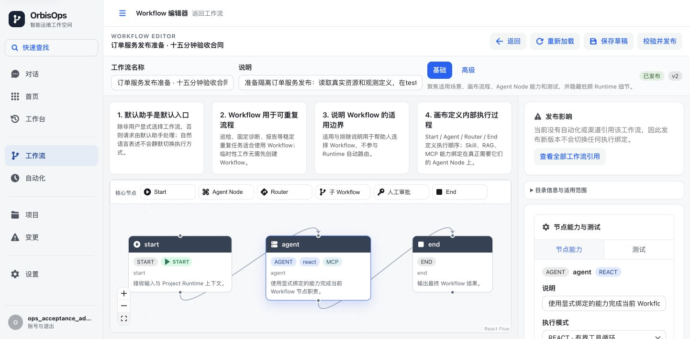
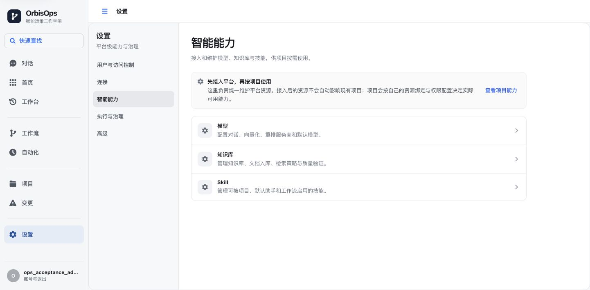
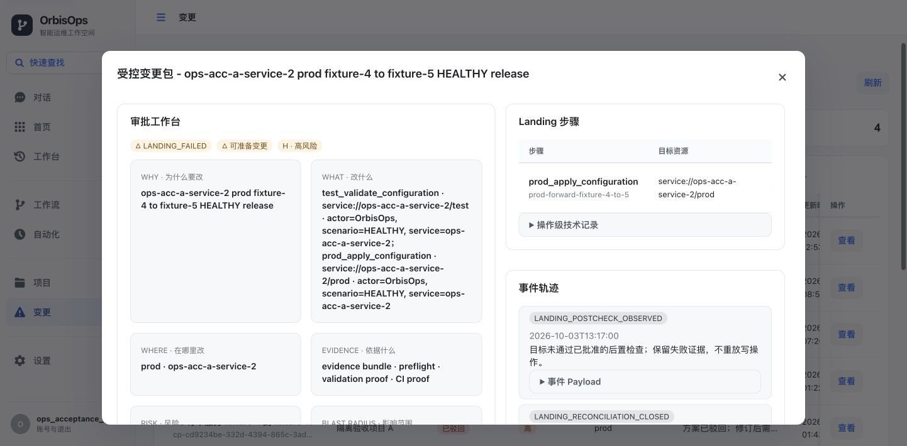
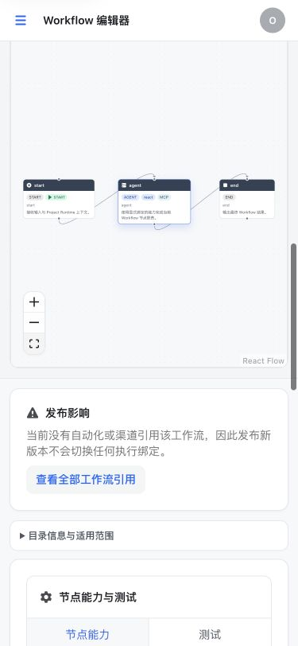

# 页面体验验收

执行日期：2026-10-03 UTC。最终页面为 <http://127.0.0.1:3302>。本批范围是页面体验与模块整理，已暂停的新模型、正式矩阵和业务 SLO 实验不计入结果。

## 发布候选

- 前端源码摘要：`3e127b01751e990de099f1a491efe793005fe35e98c1eb15ae876082fa7f4965`。
- `NODE_OPTIONS=--max-old-space-size=1536 npm run verify`：79文件/270测试通过，类型检查、发布检查和生产构建通过。
- 页面镜像：`sha256:1babd2bd797e8df90b0c050a4b853089e3a2134f0d6118daab0aa03caa3eb88f`。正常 web-only Compose 部署，静态文件与验证产物逐项相同；nginx配置和API代理正常；保留原静态发布资源。
- 后端没有重启或替换：仍为部署17/JAR `f1ee57819e256b7053862170064eb78f11ff2aa017115a9d9083ccc7a0118fc5`。前端通过不代表当前Java候选完整通过。
- Chrome extension实际桌面1442×710、窄屏375×812；各25注册路径复读实际数据、保存DOM及截图。临时窄屏已reset，实际读回1442×710。

## 路由结果

| 路径 | 桌面 | 窄屏 | 实际检查 |
| --- | --- | --- | --- |
| /home | 通过 | 通过 | 单一主区域、加载结束、无页面横溢 |
| /chat | 通过 | 通过 | 单一主区域、加载结束、无页面横溢 |
| /workbench | 通过 | 通过 | 单一主区域、加载结束、无页面横溢 |
| /workbench/events | 通过 | 通过 | 单一主区域、加载结束、无页面横溢 |
| /workflows | 通过 | 通过 | 单一主区域、加载结束、无页面横溢 |
| /automations | 通过 | 通过 | 单一主区域、加载结束、无页面横溢 |
| /projects | 通过 | 通过 | 单一主区域、加载结束、无页面横溢 |
| /changes | 通过 | 通过 | 单一主区域、加载结束、无页面横溢 |
| /settings | 通过 | 通过 | 单一主区域、加载结束、无页面横溢 |
| /workflows/config | 通过 | 通过 | 单一主区域、加载结束、无页面横溢 |
| /automations/schedules | 通过 | 通过 | 单一主区域、加载结束、无页面横溢 |
| /automations/alert-triggers | 通过 | 通过 | 单一主区域、加载结束、无页面横溢 |
| /projects/advanced | 通过 | 通过 | 单一主区域、加载结束、无页面横溢 |
| /settings/users-access | 通过 | 通过 | 单一主区域、加载结束、无页面横溢 |
| /settings/channels | 通过 | 通过 | 单一主区域、加载结束、无页面横溢 |
| /settings/models | 通过 | 通过 | 单一主区域、加载结束、无页面横溢 |
| /settings/tools | 通过 | 通过 | 单一主区域、加载结束、无页面横溢 |
| /settings/knowledge | 通过 | 通过 | 单一主区域、加载结束、无页面横溢 |
| /settings/skills | 通过 | 通过 | 单一主区域、加载结束、无页面横溢 |
| /settings/execution-targets | 通过 | 通过 | 单一主区域、加载结束、无页面横溢 |
| /settings/governance | 通过 | 通过 | 单一主区域、加载结束、无页面横溢 |
| /settings/advanced/model-catalog | 通过 | 通过 | 兼容入口跳转模型页 |
| /settings/advanced/memory | 通过 | 通过 | 单一主区域、加载结束、无页面横溢 |
| /settings/advanced/skill-evolver | 通过 | 通过 | 单一主区域、加载结束、无页面横溢 |
| /settings/advanced/tool-routing | 通过 | 通过 | 单一主区域、加载结束、无页面横溢 |

表格“通过”仅表示已加载页面及布局检查。窄表格继续使用内部横向滚动，长 JSON 证据按需展开并内部滚动；没有要求用户输入 JSON 才能使用对话。

## 实际用户路径

- 窄屏导航打开、Escape关闭、选中页面关闭均通过。设置智能分类→模型→返回，原分类保持。
- 工作流搜索已有SLO流程、打开发布v2、临时编辑名称并恢复、打开测试面板；没有保存或重新发布。正常“打开对话手动执行”创建空会话，MySQL核对绑定 `workflow-muscjv3f` v2 / `PINNED_VERSION` / 0消息。自然语言输入可启用发送按钮，随后恢复空白，未发送。
- 桌面画布三个节点及缩放控制均在可视区域；实际放大/适应视图通过。节点工具外置于画布工具栏，短/窄视区收起小地图；最终DOM命中核对三个节点中心均未被工具遮挡。窄屏适应视图后三个节点全部位于画布内，能滚动到画布操作。首次桌面高度越界和窄屏裁边证据保留，修复后重新完整验证部署。
- 变更详情保留原包v1/hash及两位独立审核事件。列表和详情均显示 `LANDING_FAILED`，原唯一写入成功回执与失败事件并列；未点击重试、复核、清理或审批。原生采集0新执行，状态未被UI改写。

手动互动记录保留实际执行镜像；最终25×2路由及画布在最终镜像重验。这里不把空会话创建、加载成功或模型口述当作业务验收完成。

## 截图

## 后端候选的验证边界

当前 Landing 复核/current-run fence Java候选已14:21:37–14:22:02 UTC自然完成小聚焦编译：27/27单元测试通过，0失败/错误/跳过，源码前后稳定；包含新7边界，未启动数据库、模型、SLO、流量或部署。原full19的10000授权行/1000ms真实Pg超时和未执行原生架构回归仍是完整候选缺项，不能称整体后端通过或已在运行版本生效。

完整摘要、路由尺寸、画布几何、截图hash与原生绑定见同目录JSON；原日志/XML、各次失败、DOM和每页截图保留于主工作目录 `work/ops-finish-20261003-*`。业务未测/失败的续作入口见[当前开发状态](../development/OrbisOps-当前开发状态.md)，结构职责见[页面与模块整理](../development/页面与模块整理.md)。

最终图像复核还保留了浮动工具遮挡节点和候选容器查询被样式编译器忽略的失败。修复后再完整270测试、正常部署及最终25×2路由；页面加载等待器的no_matches异常与对话初始加载独立保存，稳定复读后只计布局。空会话不计Workflow执行完成；首页读取失败的早期画面不计功能通过。
