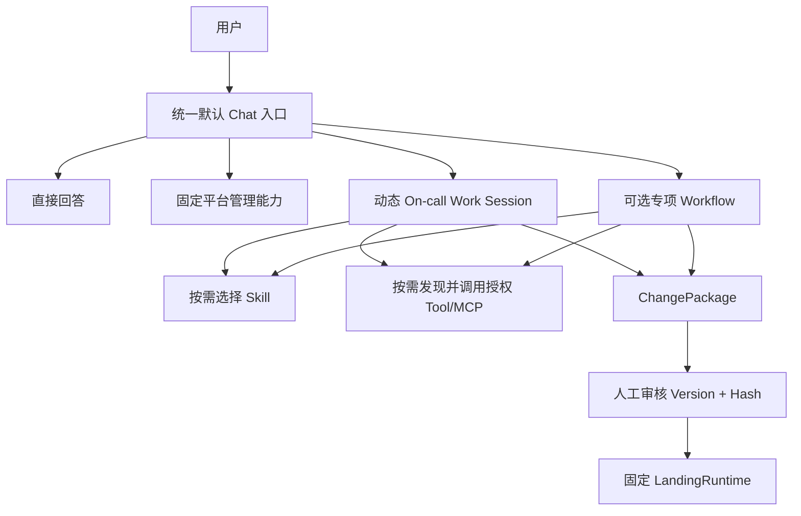

# orbisops 动态 Work Session、受控 Landing 与 Skill Evolution 简化重构方案

生成时间：2026-08-04 15:26（UTC+8）

状态：**设计已确认，暂不实施**

适用项目：`orbisops`

本文档记录 2026-08-04 讨论后形成的最新目标架构与后续改造基线。后续关于默认主助手、On-call Work Session、Preparation、ChangePackage、LandingRuntime 与 Skill Evolution 的讨论，均应以本文档描述的改造后语义为准，除非用户再次明确修改决策。

---

# 一、改造结论摘要

本轮不再继续堆叠新的 Agent、Tournament、Shadow、Canary 或细粒度 Landing 并发机制，而是将系统收敛为以下主干：



最终边界：

1. 默认 Chat 入口负责路由，不等于一个拥有全部权限的超级 Agent。
2. 动态 Agent 编排只存在于 On-call Work Session 或专项 Workflow 内部。
3. Skill 是版本化的方法知识，不是 Tool 权限和生产执行凭证。
4. 动态 Agent 世界在 ChangePackage 处结束。
5. 人工审核后只允许固定 LandingRuntime 执行冻结的操作。
6. 同一 `Project + Environment` 同时只允许一个 Active LandingRun。
7. Skill Evolution 改为“Episode 采集 → Outcome 确认 → Proposal → 确定性验证 → 受控发布”，不再把 Shadow/Canary 作为所有 Skill 的必经步骤。

---

# 二、当前实现中需要纠正的核心问题

## 2.1 默认主助手、Work Session 与 Workflow 层级混杂

当前代码已经存在统一 Chat 入口、轻量回答、固定控制面和 Project Pre-Approval Work Session，但命名和职责仍容易让人误解为“默认主助手 Agent 负责所有事情”。

改造后必须明确：

```text
统一 Chat Entry / Main Coordinator
├── Lightweight Direct Answer
├── Fixed Control Plane Action
└── Pre-Approval Work Session
    ├── Default Main Assistant Definition
    └── Specialized Workflow Definition
```

默认项目 Agent 和专项 Workflow 只是 Work Session 内部的 Definition 选择，不是平台总控。

## 2.2 MCP 目前是预绑定后按需调用，不是真正运行时按需激活

当前 MCP 主要从 Agent、Node、Scope 或 Project Capability 中预装配。运行期间模型只是按需调用已经暴露的 Tool。

后续不强求完全自由的动态激活，而应采用受控的渐进暴露：

```text
冻结授权 Toolset Boundary
→ 运行时查询 Capability Catalog
→ 在冻结边界内激活具体 Tool
→ 记录 Activation Fact
→ 不允许扩展原授权边界
```

## 2.3 Preparation 的验证步骤与 Landing 操作混在同一组 mcpSteps

当前同一组 operation 可能同时承担：

- PREPARE 阶段验证描述；
- 审批后生产 Landing 描述。

这会造成真正生产写 operation 在 PREPARE 阶段被禁止执行后，又被误算为 Preflight 失败。

后续必须拆成：

```text
validationOperations
landingOperations
```

并通过：

```text
validatesOperationId
```

建立验证操作与生产操作的关系。

## 2.4 Landing 并发策略过细且锁租约不完整

当前资源锁依赖 operation.resourceKey，缺少统一 Project + Environment 单飞；资源锁固定五分钟且未形成完整续租闭环。

后续不再区分代码、配置、数据库、Redis、MCP 等场景，统一采用：

```text
lockKey = project:{projectId}:environment:{environmentId}:landing
```

## 2.5 Skill Evolution 复杂度高于其证据可信度

当前 Skill Evolution 同时包含：

- 多候选 Authoring；
- Legacy/Strict Tournament；
- Hidden Evaluation；
- Behavior Replay；
- Model Judge；
- Validation；
- Shadow；
- Canary；
- 自动发布与回滚。

但其测试案例大量来自候选自身的 `whenToUse/whenNotToUse`、LLM 自生成 Eval Case 以及同一批历史记录，存在明显的循环验证问题。

同时，当前 Run 成功结束时就入队，只能说明 Agent 产出了一份报告，不能证明结果正确或值得沉淀。

## 2.6 Skill 生命周期只强调增加和修改，缺少遗忘和淘汰

Authoring Prompt 虽声明支持 `MERGE_SKILLS`、`SPLIT_SKILL`，但后续没有完整的领域执行链；也没有将 `DEPRECATED`、`RETIRED`、`QUARANTINED` 等生命周期方向接入 Evolution 决策。

结果是 Skill 只会越来越多，召回冲突和内容重复会持续上升。

---

# 三、改造后的统一平台架构

## 3.1 第一层：统一默认 Chat 入口

职责仅包括：

- 理解用户请求；
- 判断执行面；
- 解析固定控制面参数；
- 创建或继续 Work Session；
- 展示结果；
- 请求用户完成必要的选择或审核。

它不应拥有：

- 任意 Tool 调用权；
- 生产写权限；
- 自由审批权限；
- 绕过 ChangePackage 的变更能力。

## 3.2 第二层：四种执行面

### 直接回答

适用于不需要实时外部数据、不需要持久化工作状态的通用问答。

### 固定平台管理能力

通过 typed Application Use Case 执行，例如：

- Project 管理；
- Agent Definition 管理；
- Workflow 管理；
- Skill/MCP 导入与治理；
- ChangePackage 审批；
- Landing 请求；
- 巡检任务管理；
- 审计查询。

自然语言只负责参数抽取，最终行为由固定领域命令完成。

### 动态 On-call Work Session

适用于未知或半结构化问题：

- 故障调查；
- 多数据源证据收集；
- 动态选择子 Agent；
- 根因分析；
- 候选方案设计；
- Preparation 验证；
- 形成 ChangePackage。

### 可选专项 Workflow

专项 Workflow 不是另一套 Runtime，而是同一 Work Session Runtime 上的预配置：

- Graph；
- Skill；
- Toolset；
- Policy；
- 节点顺序；
- 适用条件。

没有高置信匹配时继续使用项目默认主助手 Definition。

## 3.3 第三层：动态工作角色

Work Session 内可存在多个动态角色：

```text
Planner / Orchestrator
Investigation SubAgents
Reflection / Review
Preparation Agent
Report Agent
```

这些角色负责：

- 决定下一步做什么；
- 选择哪个子 Agent；
- 决定还缺哪些证据；
- 根据验证结果修订候选方案；
- 判断是否形成 ChangePackage。

它们不负责：

- Tool 权限判断；
- 可信 Evidence 生成；
- Preflight 最终判定；
- 审批；
- Landing；
- 分布式锁；
- 幂等与补偿。

## 3.4 第四层：受控变更层

```text
ChangePackage
→ Human Approval
→ Fixed LandingRuntime
```

ChangePackage 是动态 Runtime 与固定生产执行面的唯一分界。

---

# 四、Preparation 重构方案

## 4.1 Preparation 的定义

Preparation 是审批前的候选方案编译与验证阶段：

```text
调查结论与可信 Evidence
→ 候选方案
→ 结构化操作
→ 非生产验证
→ 风险、前置条件、PostCheck、回滚
→ ChangePackage Draft
```

它不能执行正式生产写。

## 4.2 统一输入

Preparation 输入包括：

- User Objective；
- Investigation Evidence；
- Runtime Context Bundle；
- Candidate Actions；
- Toolset/Policy Boundary；
- 可选 Worktree 或 Sandbox 资产；
- 当前 Baseline Snapshot。

## 4.3 拆分两类 Operation

### `landingOperations`

描述审批后允许执行的生产操作：

```text
operationId
toolBinding
arguments
targetEnvironment
expectedBeforeState
postCheck
rollbackPlan
operationHash
```

### `validationOperations`

只允许：

```text
READ
VALIDATE_ONLY
DRY_RUN
MUTATE_EPHEMERAL
MUTATE_TEST_RESOURCE
WORKTREE_BUILD_OR_TEST
```

每个 validation operation 必须声明：

```text
validatesOperationId
validationType
expectedEvidence
```

## 4.4 Preflight、Dry Run、Sandbox、Worktree 的边界

### Preflight

回答：是否具备执行条件。

检查：

- Tool 和 Schema；
- 参数；
- Policy；
- 目标资源是否存在；
- 当前状态是否可读；
- Baseline 是否合理；
- PostCheck 和回滚材料是否完整。

### Dry Run

回答：目标系统按正式参数计算后预计发生什么，但不提交真实目标状态。

Dry Run 必须由目标 Tool 原生支持，平台不能凭空模拟任意生产 Tool。

### Sandbox

回答：候选方案在隔离环境真实执行后是否可工作。

允许修改临时资源，不允许修改生产资源。

### Worktree

用于代码类候选修复：

- 隔离修改；
- 编译；
- 测试；
- 生成 diffHash；
- 生成 repairCommit；
- 形成可信 Test Proof。

Worktree 只解决候选准备隔离，不赋予并行生产 Landing 权限。

## 4.5 验证失败后的行为

验证结果统一分为：

```text
PASSED
FAILED
UNSUPPORTED
UNAVAILABLE
POLICY_REJECTED
```

处理规则：

- `FAILED`：进入 `NEEDS_REFINEMENT`；
- `UNSUPPORTED/UNAVAILABLE`：进入 `MANUAL_REQUIRED`；
- `POLICY_REJECTED`：拒绝该候选；
- 任何失败都不得进入审批或 Landing；
- 保存结构化 Finding、Proof 和原因；
- 语义修改必须生成新 Candidate 或新 ChangePackage Version；
- 不允许静默调整已审批内容。

## 4.6 Preparation Agent 的合理职责

Preparation Agent 后续可以形成有限多轮闭环：

```text
候选方案
→ 确定性验证
→ 结构化 Findings
→ Agent 修订
→ 再验证
```

建议最多 2～3 轮。达到上限仍失败则转人工。

Agent 可以调整候选，但不能更改：

- Tool 授权；
- Effect Policy；
- Evidence 真实性；
- 审批状态；
- Landing 权限。

# 五、ChangePackage 与审批重构方案

## 5.1 ChangePackage 应冻结的内容

```text
packageId
version
packageHash
projectId
targetEnvironment
objective
riskLevel
baselineSnapshot
baselineHash
landingOperations
validationProofRefs
approvalBoundary
postCheckPlan
rollbackPlan
allowedLandingAdjustments
```

## 5.2 Baseline 成为一等领域对象

新增：

```text
baselineSnapshot
baselineHash
baselineObservedAt
baselineEvidenceRefs
```

Baseline 表示审批时看到的状态，不代表 Landing 时仍然成立。

## 5.3 审批绑定 Version + Hash

人工审批必须绑定：

```text
packageId + version + packageHash
```

任何实质修改都必须：

```text
version + 1
重新计算 packageHash
旧批准失效
```

---

# 六、LandingRuntime 简化与可靠性方案

## 6.1 统一 Project + Environment 单飞

不再区分代码、配置、数据库、Redis、Kubernetes 或 MCP 场景。

统一规则：

> 同一个 `projectId + environmentId`，任意时刻最多存在一个 Active LandingRun。

Active 状态至少包括：

```text
STARTING
PREFLIGHT_CHECKING
RUNNING
POST_CHECKING
ROLLING_BACK
UNKNOWN
RECONCILING
```

只有明确终态才能释放：

```text
SUCCEEDED
FAILED_WITH_NO_SIDE_EFFECT
ROLLED_BACK
CANCELLED_BEFORE_DISPATCH
MANUAL_INTERVENTION_RELEASED
```

`UNKNOWN` 不得自动释放锁。

## 6.2 Lease + Heartbeat + Fencing

Project + Environment 锁必须包含：

```text
lockKey
landingRunId
leaseToken
fencingToken
leaseExpiresAt
stateVersion
status
```

需要：

- 获取租约；
- 周期续租；
- 续租失败后停止派发新 operation；
- 当前操作进入 UNKNOWN；
- 目标 Executor/MCP 强制校验 fencingToken；
- 旧 Worker 恢复后不能继续写。

## 6.3 固定执行流程

```text
1. 校验已批准 Version + Hash
2. 获取 Project + Environment Lease
3. 创建 LandingRun 与 Operation Journal
4. 全量重新读取 Baseline
5. Baseline 漂移则 NEEDS_REPLAN
6. 按冻结顺序执行 operation
7. 每个 operation 写入前执行目标端原子 CAS
8. 执行后进行 authoritative PostCheck
9. 失败时停止后续操作
10. 按批准策略执行补偿或转人工
11. 执行 Package Final Verification
12. 完成 Journal 与审计
13. 释放 Lease
```

## 6.4 不使用跨系统 XA/2PC

异构 MCP、配置中心、数据库、部署平台之间不做分布式事务。

采用 Durable Saga / Process Manager：

- dispatch 前写 Journal；
- stable executionKey；
- idempotency；
- fencing；
- Receipt；
- authoritative PostCheck；
- compensation；
- UNKNOWN reconciliation。

---

# 七、统一 Skill 模型

## 7.1 当前问题

当前存在两套不一致表示：

```text
自由 Markdown SKILL.md
结构化 changes/routingProfile/diagnosticRecipe JSON Patch
```

后续必须统一为一个领域模型：

```text
SkillSpec
├── Identity
├── Applicability
├── Preconditions
├── Procedure
├── DecisionRules
├── EvidenceRequirements
├── OutputContract
├── FailurePolicy
└── SafetyBoundary
```

## 7.2 统一 SKILL.md 模板

```markdown
---
name: "skill-name"
description: "一句话说明"
type: "PROCEDURE"
---

# 目标

# 适用条件

# 不适用条件

# 执行步骤

# 决策规则

# 证据要求

# 输出要求

# 失败与降级

# 安全边界
```

部分章节可为空，但结构必须稳定。

治理字段不写入 Markdown，存入 Skill Catalog：

```text
version
skillHash
lifecycleStatus
mutationMode
executionMode
bindingMode
replacementSkillId
usageMetrics
```

## 7.3 Skill 的职责边界

Skill 只表达：

- 方法；
- 领域规则；
- 适用条件；
- 证据要求；
- 输出格式；
- 失败和安全边界。

Skill 不表达：

- Tool 权限；
- MCP 授权；
- 生产写授权；
- 审批结果；
- 凭据；
- Landing 操作合同。

---

# 八、Skill Evolution 简化重构方案

## 8.1 理论定位

Skill Evolution 不再被定义为“模型持续学习”或“在线策略自动优化”，而是：

> 基于已确认 Episode 与 Outcome，对版本化方法知识进行提案、修订、合并、拆分、废弃和隔离的治理流程。

它更接近：

- Case-Based Reasoning 的案例沉淀；
- Experience Replay 的历史经验复用；
- Knowledge Lifecycle Management；
- Versioned Policy/Procedure Governance。

不再声称仅凭 LLM Judge、Shadow 或 Canary 即能证明 Skill 质量提升。

## 8.2 第一阶段：Run 结束只记录 Episode

每个 Run 终态都记录不可变 Episode：

```text
episodeId
projectId
sessionId
runId
userGoal
usedSkillVersions
toolCalls
evidenceRefs
decisionTrace
finalOutput
terminalStatus
changePackageId
```

此时不判断是否“有价值”，不直接生成 Candidate。

成功、失败、取消均可记录。

## 8.3 第二阶段：Outcome 确认后生成 Learning Signal

有效信号来源包括：

```text
USER_EXPLICIT_REMEMBER
USER_CORRECTION
USER_POSITIVE_FEEDBACK
USER_NEGATIVE_FEEDBACK
INCIDENT_CONFIRMED_RESOLVED
LANDING_POSTCHECK_SUCCEEDED
LANDING_FAILED_OR_ROLLED_BACK
REPEATED_PATTERN_ACROSS_RUNS
ROUTING_CONFLICT
SKILL_STALE_OR_UNUSED
```

以下不再视为充分正标签：

```text
Run 成功结束
Agent 生成非空报告
产生了 ChangePackage
没有抛异常
```

## 8.4 用户显式意图与自动学习分开

### 用户显式要求沉淀

用户明确说“记住这个方法”“生成 Skill”“以后这样处理”时：

```text
一次即可生成 DRAFT Proposal
```

不再要求两个 Session 或多次重复。

### 自动进化

只有系统自动提出 Proposal 时，才要求：

- 跨 Run 重复；
- 来源多样性；
- Outcome 已确认；
- 与现有 Skill 的关系明确。

重复门槛用于防止自动误学习，不用于阻止用户明确创建。

## 8.5 Evolution 决策类型

统一为：

```text
CREATE
REVISE
MERGE
SPLIT
DEPRECATE
QUARANTINE
NO_CHANGE
```

### CREATE

现有 Skill 无法覆盖新的稳定方法。

### REVISE

修改步骤、证据要求、适用边界、输出或失败策略。

### MERGE

多个 Skill 高度重叠、经常发生路由竞争或主体方法相同。

合并后旧 Skill：

```text
lifecycleStatus = DEPRECATED
replacementSkillId = mergedSkillId
```

### SPLIT

一个 Skill 同时覆盖多个明显不同场景，导致内容过长或路由模糊。

### DEPRECATE

Skill 被替代、长期无使用价值或与当前系统约束不再匹配。

### QUARANTINE

出现高风险问题时立即停止正式运行：

- 危险建议；
- 连续错误路由；
- 越权方法；
- 用户明确投诉；
- 与平台安全规则冲突。

### NO_CHANGE

证据不足或没有稳定复用价值。

## 8.6 不自动硬删除正式 Skill

正式 Skill 采用：

```text
ACTIVE
→ DEPRECATED
→ RETIRED
```

只有同时满足以下条件的 DRAFT 才允许物理删除：

- 从未发布；
- 没有版本引用；
- 没有 Agent/Project 绑定；
- 没有 Episode/Context Bundle 引用；
- 超过保留期。

## 8.7 Validation 简化为确定性检查

保留：

- SkillSpec Schema；
- Evidence Reference 存在；
- Base Version/Hash 一致；
- 无危险内容；
- 无 Tool/MCP 权限扩展；
- 无生产写指令；
- 路由边界完整；
- 合并/拆分/替换引用一致；
- 与现有 Skill 明显冲突检查。

LLM 评价只作为辅助意见，不作为强验证。

## 8.8 Eval Case 必须区分来源和可信等级

```text
GOLD：人工确认或外部事实确认
OUTCOME_CONFIRMED：Landing/PostCheck/Incident 结果确认
HISTORICAL_REPLAY：历史 Episode 带明确结果标签
SYNTHETIC：LLM 或规则生成
SELF_DECLARED：候选自身 whenToUse/whenNotToUse 生成
```

只有前三类可以支撑“能力提升”判断。

后两类只能用于：

- Schema；
- 边界自洽；
- 安全检查；
- 召回覆盖检查。

禁止把 Candidate 自己生成的 Case 当作独立回归证据。

## 8.9 Shadow 和 Canary 改为可选策略

### Shadow

仅当存在独立的 GOLD、OUTCOME_CONFIRMED 或 HISTORICAL_REPLAY 数据时运行。

没有独立数据时明确返回：

```text
NO_INDEPENDENT_EVAL_DATA
```

而不是临时生成几条测试来宣称通过。

### Canary

仅用于：

- 高频 Skill；
- 有明确结果指标；
- 新旧版本面对可比流量；
- 能归因到 Skill 版本。

低频运维 Skill 不强制 Canary。

### 发布策略

```text
MANUAL_ONLY
→ Proposal + Validation
→ 人工审核发布

AUTO_LOW_RISK
→ Proposal + Validation
→ 可选 Replay/Canary
→ 自动发布

SAFETY_CRITICAL
→ 必须人工审核

QUARANTINED/LOCKED/SEALED
→ 禁止发布
```

## 8.10 发布后观察

发布后仍保留：

- 版本；
- usage；
- 用户反馈；
- 路由冲突；
- Outcome；
- 回滚。

但代理指标不能被表述为真实正确率。

例如：

```text
Run succeeded ≠ 根因正确
ChangePackage created ≠ 修复有效
No exception ≠ Skill 有效
```

# 九、改造后的预期效果

## 9.1 用户体验

- 用户明确要求沉淀方法时，一次即可生成 Draft；
- 不再要求低频问题发生十几次才能看到 Skill；
- Skill 状态和进化阶段可理解；
- 自动创建、人工审核、自动发布边界清楚；
- 旧 Skill 可以被合并、替换、废弃和隔离。

## 9.2 Runtime 架构

- 默认入口职责清晰；
- Work Session 与专项 Workflow 共用同一 Runtime；
- 动态 Agent 只负责决策，不负责权限和生产执行；
- ChangePackage 成为唯一生产变更出口；
- Landing 并发模型从细粒度资源锁简化为 Project + Environment 单飞。

## 9.3 Preparation

- 验证 operation 与生产 operation 分离；
- Dry Run、Sandbox、Worktree 的语义稳定；
- 验证失败可结构化修订；
- 不再误将“生产写未在 PREPARE 中执行”当作失败。

## 9.4 Landing 可靠性

- 同一 Project + Environment 不会并发落地；
- Lease 过期后旧 Worker 无法继续写；
- Baseline 漂移时 fail-closed；
- 每步通过目标端 CAS 和 PostCheck；
- UNKNOWN 不允许盲目重放；
- 补偿和人工介入边界明确。

## 9.5 Skill 质量治理

- 不再依赖循环生成的测试证明质量提升；
- Outcome 确认比 Run 成功更可信；
- Skill 生命周期从单向增长变为完整治理；
- Validation、Replay、Canary 与风险和流量匹配；
- 系统复杂度显著下降。

---

# 十、建议实施阶段

本文档暂不实施。后续真正开始时，建议按以下顺序推进，禁止并行大改。

## 阶段 A：文档与领域语义冻结

1. 冻结四层平台架构术语；
2. 冻结 Preparation 与 Landing 边界；
3. 冻结 SkillSpec 模板；
4. 冻结 Episode、Outcome、Proposal、Release 术语；
5. 更新 ADR 和 Context Map。

验收：所有主要类、API、文档不再混用“默认主 Agent”“编排 Agent”“Preparation Runtime”等概念。

## 阶段 B：Landing Project + Environment 单飞

1. 引入 `LandingScopeKey(projectId, environmentId)`；
2. 替换现有 resourceKey 级 Admission Lock；
3. 增加 Lease Renew；
4. 增加 Fencing；
5. UNKNOWN 保持占用；
6. 增加多实例并发与失租测试。

验收：同一 Scope 严格串行，不同 Scope 可并行，旧 Worker 不可继续写。

## 阶段 C：Preparation Operation 拆分

1. 建模 `ValidationOperation`；
2. 建模 `LandingOperation`；
3. 增加 `validatesOperationId`；
4. 改造 Preflight、Dry Run、Sandbox、Worktree；
5. 改造 ChangePackage Schema 与版本 Hash；
6. 增加失败 Finding 与 revise 链。

验收：PREPARE 永不派发生产写 operation，且生产 operation 不会因未执行而被判定失败。

## 阶段 D：统一 SkillSpec

1. 引入 SkillSpec；
2. 将 Markdown Codec 改为 SkillSpec 渲染和解析；
3. 将 routingProfile、diagnosticRecipe 等 JSON Patch 收敛到 SkillPatch；
4. 保持旧 Skill 双读迁移；
5. 增加版本 Hash 与包兼容验证。

验收：文件、Catalog、Evolution Candidate 和 Runtime 使用同一个语义模型。

## 阶段 E：Episode 与 Outcome

1. Run 终态只 Capture Episode；
2. 移除 `Run succeeded → valuable` 语义；
3. 接入用户反馈；
4. 接入 Incident 关闭；
5. 接入 Landing、PostCheck、rollback；
6. 生成 typed LearningSignal。

验收：没有 Outcome 的 Episode 不会直接生成自动发布 Candidate。

## 阶段 F：Skill Proposal 生命周期

1. 实现 CREATE、REVISE、MERGE、SPLIT、DEPRECATE、QUARANTINE、NO_CHANGE；
2. 用户显式创建一次即可生成 Draft；
3. 自动进化使用重复性和来源多样性；
4. 接入 replacementSkillId；
5. 接入 DEPRECATED、RETIRED、QUARANTINED。

验收：旧 Skill 可被正确替换、停止召回并保留审计。

## 阶段 G：删除强制 Tournament、Shadow、Canary 主链

1. Tournament 降级为实验性可插拔比较器；
2. Eval Case 增加 provenance 和 quality；
3. Shadow 仅对独立数据启用；
4. Canary 仅对高频且可度量 Skill 启用；
5. MANUAL_ONLY 默认人工发布；
6. AUTO_LOW_RISK 可自动发布。

验收：低频 Skill 不需要十几次运行才能发布；无独立测试数据时系统不会虚假宣称验证通过。

## 阶段 H：管理界面与审计

展示：

```text
Episode Captured
Outcome Confirmed
Proposal Drafted
Validation Passed/Failed
Awaiting Review
Published
Deprecated
Quarantined
Rolled Back
```

验收：用户可以清楚知道“发现了经验”“形成了候选”“正式发布”是三个不同阶段。

---

# 十一、非目标

本轮不追求：

- 构建通用在线强化学习平台；
- 自动证明 Skill 绝对正确；
- 所有 Skill 全自动发布；
- 所有 Tool 运行时自由激活；
- 多 ChangePackage 在同一 Project + Environment 内并行 Landing；
- 跨异构外部系统 XA/2PC；
- 自动物理删除所有旧 Skill；
- 继续增加没有独立数据支撑的 Judge/Tournament 层。

---

# 十二、后续讨论默认前提

后续对话中，除非用户明确推翻，本项目按以下“改造后效果”理解：

1. 默认 Chat 入口负责四路分流。
2. 默认主助手和专项 Workflow 运行在统一 Work Session Runtime。
3. Skill 和 MCP 在授权边界内按需选择，Skill 不携带权限。
4. Preparation 支持动态方案修订，但验证和安全判定是确定性的。
5. `validationOperations` 与 `landingOperations` 已概念分离。
6. ChangePackage 冻结 Version、Hash、Baseline、Operations、Proof 和 Approval Boundary。
7. Landing 使用 Project + Environment 单飞、Lease、Heartbeat、Fencing、CAS、PostCheck 和 Reconciliation。
8. Run 结束只记录 Episode，不直接认为 Skill 值得进化。
9. Outcome 确认后才形成 Learning Signal。
10. 用户明确要求沉淀时，一次即可生成 Draft Proposal。
11. Skill Evolution 支持 CREATE、REVISE、MERGE、SPLIT、DEPRECATE、QUARANTINE、NO_CHANGE。
12. Validation 以确定性检查为主；Shadow、Canary 为条件性可选策略。
13. 旧 Skill 不自动硬删除，而是 Deprecated、Retired，并保存 replacement 关系和完整版本审计。

以上内容是后续设计、代码改造和验收讨论的最新权威基线。
